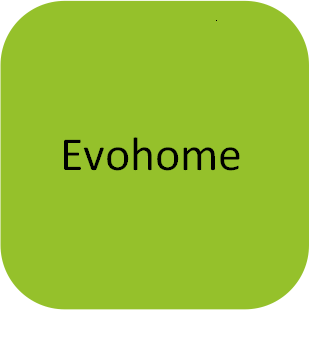

# evohome4jeedom

This is a plugin for Jeedom 3.0 platform, regarding the Honeywell Evohome system. 
State is : v0.4.2 - "PHP7.2 & Mobile app compatibilities"

Written in php, the Jeedom main langage, a bit of javascript, of course some html, and, at this time, a forked (NEW 0.3.0 \*) python bridge from the excellent python library "evohome" from watchforstock. 
Great thanks to him. His implementation can be ***[found here](https://github.com/watchforstock/evohome-client)***  
*(\*) : see "Under the hood" of the changelog file, under revision 0.3.0*

Features covered first my needs to get a triggerable injection of full week scheduling in the main evotouch console 
The temperatures and setpoints are showed inside room (called also 'zone' or 'TH') components, with history availability 
NEW 0.2.0 : you can now edit full schedule, one zone and full week at a time 
NEW 0.3.0 : under the jeedom community pressure, it proposes now to set the heatpoint up/down/reset. 
More, a statistics panel on every TH widget could appear if requested from the Console 

Install and try, from GIT with your favorite FTP client (so you have the possibility to remove the plugin in case of general crash ;) 
  1. Follow the installation by zip file, as seen in bottom of https://jeedom.github.io/core/en_US/plugin
  2. Just unzip in a folder named 'evohome' inside the plugins folder, then grant to www-data for owner and group parts, with the "rwx" rights, set "r-x" for others (or 0775 when under www-data user) 
- NEW (since 2018-12) : just install from the Market where the plugin is published in stable status :)

As you will see, the configuration is very simple. 

On the general properties page, you have to set your username and password, which pair is the account you have to create/created on
the official Honeywell web application (same as one linked with the phone's application). 
In the same page, you can adjust the period of refresh, so full informations like temp. but also schedule for all the rooms are read. 
NEW 0.3.0 : a Synchronize button helps you to create all the components for the location chosen (so, after saving your credentials) 
Please note that for existing installation, the Synchronize action will add the new commands in the Console and TH equipements ;) 
NEW 0.3.2 : a Refresh button appears, which avoid the sequence : Save configuration (crendential), close the panel, re-open the panel

NEW 0.3.0 : more easy scenarios settings (was by script before) : 
To change setting mode, restore schedule from file or change heatpoint of zone, just use the add action with the command you want,
and choose the right value in the select list ;) 
About setting mode and changing heatpoint, time limit is not settable, by the possibilities you have to plan as you want with the scenarios ;) 
Please note as a schedule file is set in at least one scenario, it could not be deleted from the Console panel.

**Warning : some operations take times**, near 2mn for the schedule restoring, just be patient when you see the rolling picture. 
NEW 0.3.2 - and take an eye on the information which appears now on the top of screen ;)

Last but not least, a ***[Jeedom blog is dedicated to this Evohome plugin](https://www.jeedom.com/forum/viewtopic.php?f=143&t=31647)***  
Don't hesitate to contact me in this blog for any question or problem you could encouter.

Enjoy !
