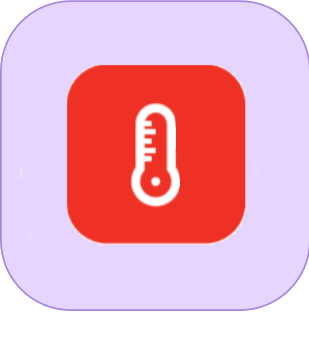

Plugin permettant l'intégration des systèmes Honeywell **Evohome, Round T87RF, Lyric T6/T6R**

*Pour la partie Evohome/Round, basé sur l'excellente  **[librairie de watchforstock](https://github.com/watchforstock/evohome-client)**&nbsp;(fork embarqué depuis 0.3.0)*     

# Possibilités
- capacité de gérer plusieurs localisations, multi-systèmes (exemple : Evohome + Lyric)
- supporte l'affichage des températures en °C ou °F
- affichage des températures et consignes actives sur les widget (TH) de chaque zone, le tout avec gestion d'historique (qui comprend également les consignes programmées)
- des statistiques minimalistes sont affichables sur les TH
- réglage du mode de présence, manuellement via le widget Console (Console) ou par Scénario (voir [contraintes](#lyric_presence) sur Lyric)
- modifier les consignes manuellement via les TH ou par Scénario
- possibilité de sauvegarder et charger des programmes hebdomadaires (manuellement ou par Scénario)
- éditeur complet des programmes hebdomadaires

Depuis 0.4.0 : gère la multi-localisations et le Round-Thermostat T87RF (2025=NL,2033=EN,2041=IT,FR,ES,2059=DE) 
**/!\ ATTENTION - VOUS DEVEZ LANCER UNE SYNCHRONISATION LORS DE LA MISE A JOUR DE LA VERSION 0.3.x VERS 0.4.x** 
**/!\ Sauvegarde préalable hautement conseillée. Contactez-moi pour tout problème d'update**

Depuis 0.5.0 : gère désormais les thermostats **Lyric T6/T6R**  

Depuis 0.5.4/5 : Compatibilité **Jeedom 4.2.x**  

Depuis 0.6.0 : Compatibilité **Jeedom 4.4.x**  

Depuis 0.6.1 : Ajout de cmd info "Demande de chauffage" (boiler request)  

# Page configuration
## Initialisation
### Evohome et Round T87RF
Saisir login et mot de passe, tels que vous les avez définis sur le site officiel. 

### Lyric T6/T6R
Un peu plus compliqué, vu que l'authentificaiton s'effectue sous protocole OAuth2 :
- Créer un compte sur le [site développeurs d'Honeywell](https://developer.honeywellhome.com) ("SIGN UP")
- Cliquer sur 'Create New App', mettre le nom 'Jeedom' (par exemple), et 'Callback URL' avec l'URL de Jeedom, terminée par "/plugins/evohome/core/php/lyric.callback.php". 
Ce qui donne quelque chose du genre : 
http://<ip-de-votre-jeedom>[:port_specifique]/plugins/evohome/core/php/lyric.callback.php 
Peu d'intérêt à utiliser votre URL publique, puisque vous ne ferez cette opération qu'une fois *(et supposément depuis votre réseau local)*. 
NB : depuis 0.5.5, "core/php" remplace "core/class" dans cette URL.
- Cliquer sur le nom de l'application pour accéder aux clefs 'consumer key' et 'consumer secret'
- Recopier alors ces informations dans la page de configuration *(après avoir sélectionné le Système Lyric, évidemment)*
- Cliquer sur Initialisation. 
Cela ouvre une page d'authentification sur le site d'Honeywell, qui vous invite à saisir login et mot de passe de votre compte Lyric (qui est celui que vous utilisez pour l'application mobile 'Honeywell Home', et n'est donc pas celui créé ci-dessus), puis finaliser la procédure en suivant les instructions
- Après cela, la page doit se fermer et un token est initialisé dans le plugin (puis automatiquement rafraîchi toutes les 20mn *(via une tâche cron créée dans le moteur de tâches : class=evohome, function=main_refresh)* 

### Cliquer ensuite sur le bouton Synchroniser
sur chaque localisation existante, une Console va être créée, ainsi que les équipements pour chaque zone trouvée. 
NB1 : le nommage des équipements utilise le préfixe modifiable "TH" + " " + [nom de la zone]. 
NB2 : les TH sont rattachés aux objets parents comportant le même nom ou similaire que celui de la zone (A dans B ou B dans A, indépendant de la casse) 
**=> en cas d'erreur lors de la synchronisation, n'hésitez pas à me contacter via le forum**

## Autres réglages disponibles

### Console
  - (sauf Lyric) choix de l'affichage des choix des modes de présence : intégré à la Console ou déporté en popup

### Thermostats
  - style de la barre de titre
  - unité d'affichage des températures et consigne
  - (sauf Lyric) précision d'affichage
  - mode de réglage manuel des consignes : intégré (mode permanent), par popup (réglage de la durée)

### Programmes hebdomadaires
  - mode d'affichage par défaut (lors de l'action des boutons Pc et Ps)
  - activation du mode édition

### Historique
  - période de lecture (des températures et du programme hebdomadaire)
  - possibilité de caler la période sur l'horloge (exemple : 15mn donnera HH:00, HH:15, etc.) 
    NB : bien que le système de lecture ait été amélioré au fil des versions, il reste déconseillé de régler la période à 10mn pour éviter des erreurs à répétition (sur la lecture précise, dite V1)
  - durée de rétention de l'historique (des températures, consignes réelles et programmées) : permet de régler toutes vos zones en une seule action

# Utilisation
Tout est fait pour être intuitif, faites-moi savoir si vous avez besoin d'explication détaillée !

## Quelques détails
- boutons Pc et Ps
    - Pc : programmation courante
    - Ps : programmation de la sauvegarde (celle affichée dans la liste déroulante)
- un indicateur Batterie apparait dans le coin gauche de la barre de titre des TH, en cas de défaillance. 
Si la batterie est 100% HS (le thermostat ne répond plus), la température elle-même est remplacée par un icone indicatif.
- si un mode statistique est activé, des flèches animées verte (vers le haut) et rouge (vers le bas) peuvent apparaitre à droite des températures. Signifient respectivement : température en hausse ou en baisse par rapport à la mesure précédente.
- l'édition des programmes hebdomadaires n'est disponible que sur l'affichage horizontal
- les valeurs min/max des consignes réglables sur chaque thermostat sont dynamiques (données Honeywell). Ces valeurs sont réglables sur la console physique (du moins sur Evohome ; défaut : 5/25).

## Spécificités Lyric

- Modes de présence
    - le mode Vacances n'est pas sélectionnable, mais est affiché si vous l'avez sélectionné depuis votre système
    - le choix du mode Planning ou Détection s'accompagne du choix d'un programme. Idem via les Scénarios ;)
- Programmation
    - l'édition n'est disponible qu'en mode Planning
    - est affichée (sans possibilité d'édition) en mode Geofence et Vacances 
      Vous pouvez cependant sauvegarder la programmation Geofence, et la réinjecter *(non disponible en mode Vacances)*
- Widget TH
    - ne dispose pas des boutons Pc/Pc (inutiles, puisque identiques sur la console)
    - un icone est affiché représentant la présence *(selon vos paramétrages Geofence dans votre système)*

# Scénario

Le pilotage par Scénario est très simple : il vous suffit d'ajouter une commande de type action, et choisir le paramètre dans la liste déroulante. 
Soit :
- Réglage mode 
/!\ Lyric : accompagné du programme à restaurer
    - le second choix permet de revenir au dernier programme actif avant celui en cours
- Set consigne 
    - le premier choix permet de revenir à la température programmée 
    - les 4 suivants permettent d'agir en relatif à partir de la consigne courante (-1, -0.5, +0.5, +1) 
    - le résultat est un changement permanent (aucun intérêt à prévoir une durée, justement par le fait que ces changements sont pilotés par Scénario)
- Restaure 
Charge une programmation sauvegardée au préalable via la Console ou l'éditeur de programmes
    - /!\ lorsqu'un programme est utilisé dans un Scénario, vous ne pouvez plus le supprimer depuis la Console
- Depuis 0.6.1, la console comporte un cmd info permettant de savoir si le système est en demande de chauffage (au moins 1 TH affiche la flamme). 
Le nom de ce nouveau cmd est "Demande chauffage", l'accès à l'info en scénario est donc, par exemple : #[Maison][Console][Demande de chauffage]#

# Forum
N'hésitez pas à visiter le **[forum dédié](https://community.jeedom.com/t/plugin-evohome)** pour toute question ou suggestion.

# Changelog
Se trouve dans le fichier dédié (en anglais), et accessible en standard via le bouton dédié sur les écrans de Jeedom : market ou configuration générale du plugin.